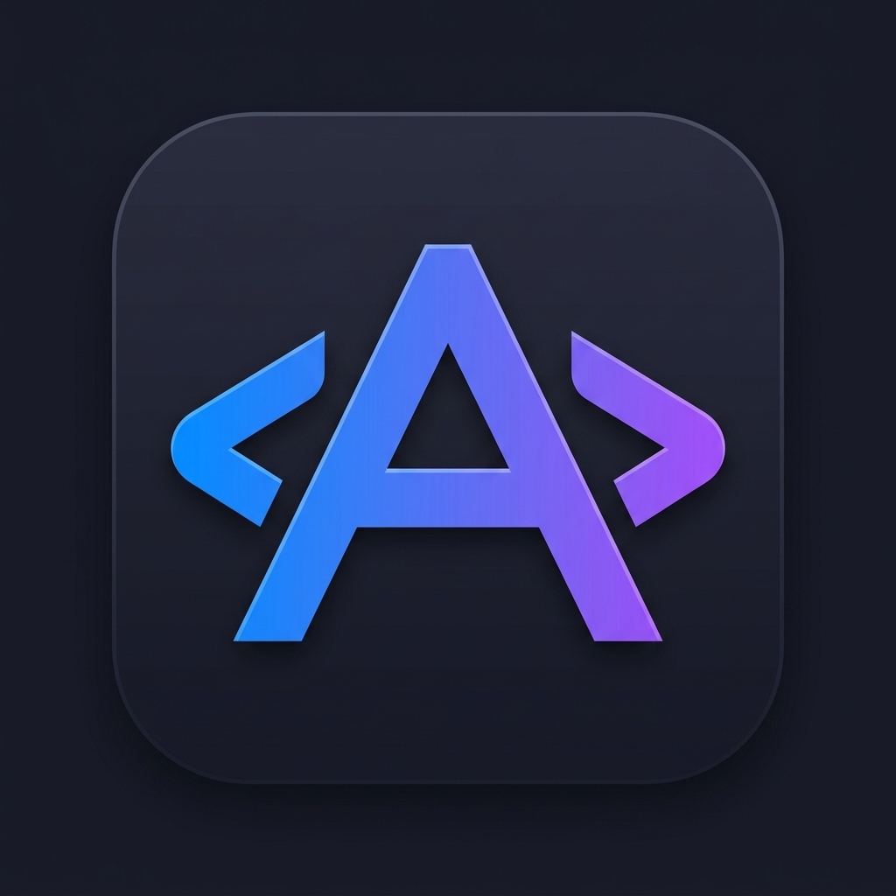
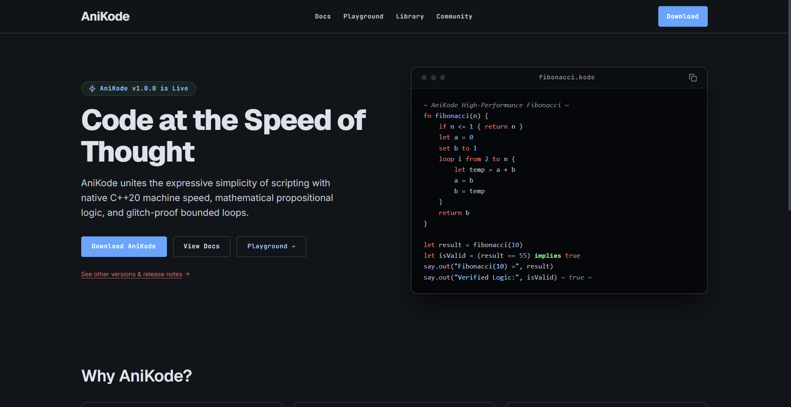
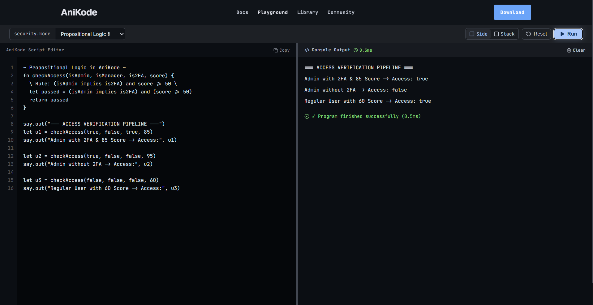

<div align="center">
  

# AniKode

A statically-guarded, dual-target programming language combining the simplicity of dynamic scripting with ahead-of-time native C++20 compilation.

<br />

[](LICENSE)
[](https://en.cppreference.com/w/cpp/20)
[](https://nodejs.org)
[](https://github.com/Igx-Anikesh/AniKode/releases)
[](https://github.com/Igx-Anikesh/AniKode/tree/main/web)

<br />

<p align="center">
  <a href="#quick-installation">Quick Install</a> •
  <a href="#core-capabilities">Capabilities</a> •
  <a href="#syntax-overview">Syntax Guide</a> •
  <a href="#dual-engine-architecture">Architecture</a> •
  <a href="#cli-reference">CLI Reference</a> •
  <a href="#web-platform">Web Playground</a>
</p>

</div>

---

<div align="center">
  
</div>

---

## Overview

AniKode is engineered to bridge the divide between rapid prototyping languages and high-throughput compiled systems. It delivers an intuitive syntax with native guardrails against runtime errors, coupled with a dual-execution pipeline that can either run immediately in an isolated V8 environment or transpile directly to zero-overhead, template-specialized C++20 standard machine code.

### Why AniKode

- **Dual-Target Execution:** Write once, run instantly via the V8 scripting VM or compile down to optimized native machine binaries using `g++ -O3 -static` with zero garbage collector pauses.
- **Statically Guarded Iteration:** Range loops automatically deduce stepping direction at parse time, eliminating infinite freeze bugs caused by inverted loop bounds.
- **First-Class Propositional Logic:** Native boolean operators (`implies`, `iff`, `xor`, `nand`, `nor`, `xnor`) for formal verification, policy evaluation, and conditional rules.
- **Dynamic Recursive Scoping:** The `recurse()` keyword automatically resolves the active parent function scope, preventing broken references during function refactoring.
- **Polymorphic Standard Operations:** Unified operations like `.len()`, `.trim()`, `.upper()`, `.has()`, and `.split()` work consistently across strings, lists, and maps.
- **Zero-Dependency Portable Binary:** Distributed as a standalone executable (`anikode.exe`) with no required runtime installations.

---

## Quick Installation

### Windows 1-Liner (PowerShell)

Install the latest binary, register `.kode` file associations, and configure PATH automatically:

```powershell
irm https://raw.githubusercontent.com/Igx-Anikesh/AniKode/main/install.ps1 | iex
```

### Direct Executable Download

Download the precompiled single-binary executable directly from [GitHub Releases](https://github.com/Igx-Anikesh/AniKode/releases/latest):

```text
https://github.com/Igx-Anikesh/AniKode/releases/latest/download/anikode.exe
```

### Build from Source

Prerequisites: Node.js 20+, g++ (MinGW-w64 or Clang with C++20 support).

```powershell
git clone https://github.com/Igx-Anikesh/AniKode.git
cd AniKode
npm install
powershell -ExecutionPolicy Bypass -File build-exe.ps1
```

---

## Syntax Overview

### 1. Variables and Type System

Declarations support strict binding (`let`), expressive assignment (`set ... to`), and implicit syntax:

```kode
let language = "AniKode"
set version to 2.0
let isCompiled = true

say.out("Language:", language, "Version:", version)
```

### 2. Safeguarded Range and Collection Loops

Range loops evaluate start and end boundaries to enforce safe termination:

```kode
~ Range loop (Direction safely inferred from bounds)
loop i from 1 to 5 {
  say.out("Iteration:", i)
}

~ Collection loop over lists
set technologies = ["C++20", "Node.js", "TypeScript", "Next.js"]
each tech in technologies {
  say.out("Target:", tech)
}
```

### 3. Propositional Logic Rules

Verify business logic, access control, and mathematical properties using first-class logic operators:

```kode
fn verifySecurityPolicy(isAdmin, has2FA, clearanceLevel) {
  let rule1 = isAdmin implies has2FA
  let rule2 = (clearanceLevel >= 75)
  
  return rule1 and rule2
}

let granted = verifySecurityPolicy(true, true, 85)
say.out("Access granted:", granted)
```

### 4. Recursive Algorithms with recurse()

```kode
~ Recursive Binary Search in AniKode
fn binarySearch(arr, target, low, high) {
  if low > high {
    return -1
  }
  
  let mid = math.floor((low + high) / 2)
  let midVal = arr[mid]
  
  if midVal == target {
    return mid
  } else if midVal > target {
    return recurse(arr, target, low, mid - 1)
  } else {
    return recurse(arr, target, mid + 1, high)
  }
}

set data = [12, 24, 37, 49, 58, 67, 78, 92]
let result = binarySearch(data, 58, 0, data.len() - 1)
say.out("Target index:", result)
```

### 5. Structured Error Handling

```kode
fn calculateRatio(numerator, denominator) {
  if denominator == 0 {
    throw "DivisionByZeroError: Denominator cannot be zero."
  }
  return numerator / denominator
}

try {
  let val = calculateRatio(100, 0)
  say.out("Result:", val)
} catch err {
  say.out("Handled exception:", err.message)
} finally {
  say.out("Execution finalized.")
}
```

---

## Dual-Engine Architecture

AniKode implements a unified compiler pipeline that compiles AST nodes into either optimized C++20 or sandboxed JavaScript:

```text
                             Source File (.kode)
                                      |
                                  [ Lexer ]
                                      |
                              Token Stream (Tokens)
                                      |
                                 [ Parser ]
                                      |
                             Abstract Syntax Tree
                                      |
                    +-----------------+-----------------+
                    |                                   |
             [ Native Transpiler ]             [ V8 JS Transpiler ]
                    |                                   |
            C++20 Source (.cpp)                  JavaScript Stream
                    |                                   |
           [ g++ -O3 -static ]                 [ Sandboxed VM Context ]
                    |                                   |
          Native Machine Binary (.exe)         Instant Terminal Output
```

### Engine Comparison

| Feature | Native C++20 Engine | Sandboxed V8 VM |
| :--- | :--- | :--- |
| **Execution Target** | Standalone Machine Code (`.exe`) | Isolated Node.js / Browser Runtime |
| **Execution Flag** | `--native` / `build` | `--js` / Default Fallback |
| **Garbage Collection** | None (Value semantics + RAII) | V8 Automatic GC |
| **Optimization Level** | `g++ -O3 -std=c++20` | JIT Optimized Bytecode |
| **Startup Time** | Instant binary execution | ~10-20ms VM initialization |
| **Best Used For** | Production performance, algorithms | Interactive REPL, Web Sandbox |

---

## CLI Reference

The AniKode CLI runner handles file execution, compilation, and environment detection:

```bash
# Execute with automatic backend selection (Native if g++ available, else JS)
anikode run script.kode

# Force native C++ compilation and execution
anikode run script.kode --native

# Force sandboxed V8 JavaScript execution
anikode run script.kode --js

# Compile directly to a standalone native binary (.exe)
anikode build script.kode
```

### CLI Command Options

| Command | Option | Description |
| :--- | :--- | :--- |
| `run <file>` | *(default)* | Runs the file using the best available compiler backend. |
| `run <file>` | `--native` | Enforces compilation through `g++ -O3 -std=c++20`. |
| `run <file>` | `--js` | Runs inside the isolated V8 JavaScript VM sandbox. |
| `build <file>` | *(none)* | Transpiles and compiles `<file>.kode` into a standalone `.exe`. |
| `help` | `-h, --help` | Displays compiler usage options and version information. |

---

## Web Platform & Interactive Sandbox

The `web/` directory contains a full-stack Next.js web application featuring an interactive in-browser IDE, comprehensive documentation, and a community algorithm library.

<div align="center">
  
</div>

### Running the Web Platform Locally

```bash
cd web
npm install
npm run dev
```

Open [http://localhost:3000](http://localhost:3000) in your browser.

- **Interactive Playground:** Split-pane editor with syntax highlighter, hotkey execution (`Ctrl + Enter`), and layout toggles.
- **Algorithm Library:** Pre-tested community algorithms and data structures with 1-click execution.
- **Language Documentation:** Interactive language specification, operator matrices, and AST lifecycle documentation.

---

## Project Structure

```text
AniKode/
├── assets/                  # Brand logos, icons, and interface preview assets
├── kode_files/              # Example scripts and benchmark files
├── web/                     # Next.js 14 Web Application & In-Browser IDE
│   ├── src/app/             # App Router pages (docs, library, sandbox, community)
│   ├── src/components/      # UI components (Editor, Terminal, Navbar, SnippetCard)
│   └── src/lib/compiler/    # In-browser TypeScript Lexer, Parser, and Transpiler
├── lexer.js                 # Lexical analyzer and token scanner
├── parser.js                # Recursive descent parser & AST generator
├── codegen.js               # JavaScript code generator (V8 runtime bridge)
├── cppgen.js                # C++20 native code generator & runtime templates
├── runner.js                # Unified CLI entrypoint and native compiler orchestrator
├── install.ps1              # Windows 1-liner automated installer script
├── build-exe.ps1            # Standalone binary build workflow
└── package.json             # Project dependencies and script tasks
```

---

## Contributing

Contributions to the compiler, runtime library, documentation, or web playground are welcome:

1. Fork the repository.
2. Create a feature branch: `git checkout -b feature/name`.
3. Commit your changes: `git commit -m "feat: description"`.
4. Push to your branch: `git push origin feature/name`.
5. Open a Pull Request with a summary of the changes and test verification.

---

## License

This project is licensed under the [MIT License](LICENSE).

---

## Author

Created and maintained by **Anikesh**.